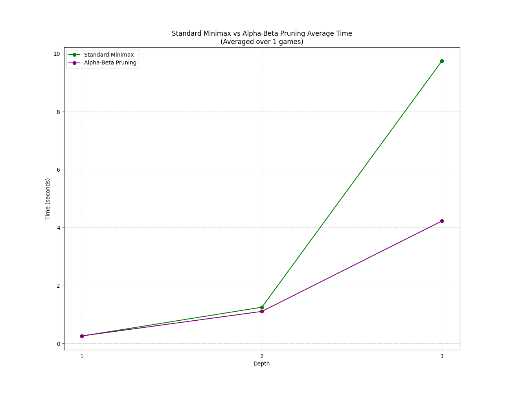

# Adversarial Search: Minimax & Alpha-Beta Pruning

A comparison of game-tree search runtimes with and without Alpha-Beta pruning in Checkers which is zero-sum environment.

## Evaluation Metric
Piece score difference with extra weight for kings:
$$\text{Score} = (\text{Pieces}_{\text{white}} + \text{Kings}_{\text{white}}) - (\text{Pieces}_{\text{red}} + \text{Kings}_{\text{red}})$$

## Runtime Results

| Depth | Standard Minimax (s) | Alpha-Beta Pruning (s) |
|---|---|---|
| 1 | ~0.26 | ~0.25 |
| 2 | ~1.28 | ~1.14 |
| 3 | ~9.76 | ~4.26 |

At depth 3, Alpha-Beta pruning reduces search time from ~9.8s to ~4.3s by cutting branches that don't affect the final move.
