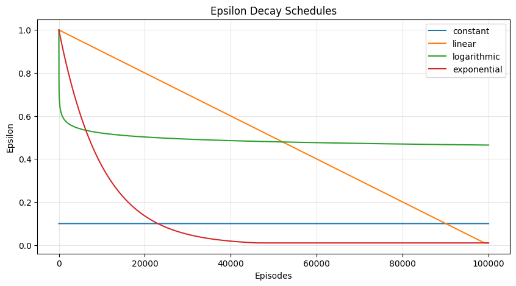
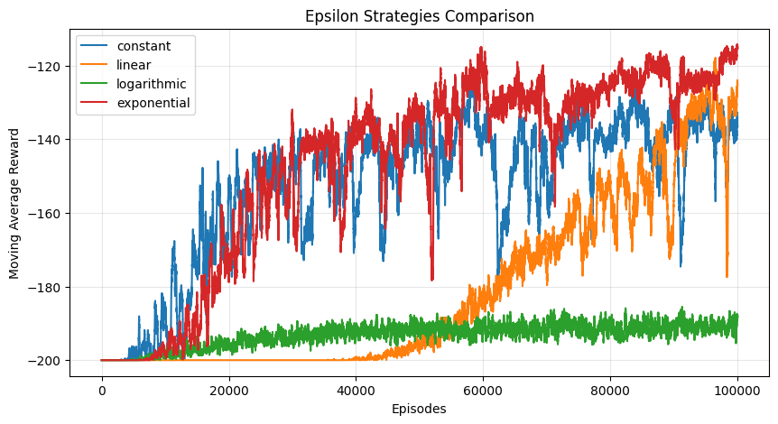
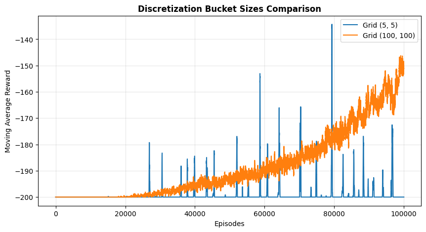
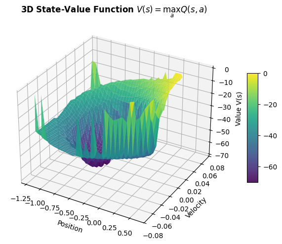

# Mountain Car Q-Learning

A tabular Q-learning implementation to solve the classic MountainCar-v0 control problem by discretizing its continuous state space.

## Overview

The Mountain Car problem consists of an underpowered car placed in a valley between two hills. The goal is to drive up the steep hill on the right to reach the flag. Because gravity is stronger than the car's engine, the agent must build momentum by moving back and forth between the two hills.

This project implements:
* State discretization to convert continuous position and velocity into discrete grid bins.
* Standard Q-learning algorithm with a Bellman update rule.
* Multiple exploration strategies to compare learning stability and convergence speed.

## Repository Structure

* `mountain_car_qlearning.py`: Contains the main `QLearningAgent` class, discretization logic, Q-table update rule, and the `watch_agent` helper to render the trained car.
* `experiments.py`: Runs baseline training, generates the 3D value function surface, and compares different epsilon decay strategies and bucket grid sizes.

## Algorithm & Methodology

### 1. State Discretization
MountainCar-v0 provides continuous observations:
* Position: `[-1.2, 0.6]`
* Velocity: `[-0.07, 0.07]`

To use tabular Q-learning, the continuous space is mapped into a discrete grid of bins (buckets), with a default size of `(40, 40)`:
$$\text{index} = \left\lfloor \frac{\text{state} - \text{lower bound}}{\text{upper bound} - \text{lower bound}} \times \text{bucket size} \right\rfloor$$

### 2. Q-Learning Update Rule
The agent updates action values using the standard off-policy Bellman equation:
$$Q(s, a) \leftarrow Q(s, a) + \alpha \left( r + \gamma \max_{a'} Q(s', a') - Q(s, a) \right)$$

where:
* $\alpha = 0.05$ (learning rate)
* $\gamma = 0.99$ (discount factor)

## Experiments & Analysis

### 1. Exploration Strategies (Epsilon Schedules)
We compared four different decay strategies for the exploration rate ($\epsilon$):
* **Constant:** Fixed exploration rate throughout training ($\epsilon = 0.1$).
* **Linear Decay:** Decreases linearly across episodes from $1.0$ down to $0.01$.
* **Logarithmic Decay:** Drops sharply at the beginning and flattens out around $0.5$.
* **Exponential Decay:** Smooth decay that allows broad initial exploration followed by exploitation.

  
  

**Key Observations:**
* **Exponential decay** achieves the most stable convergence, rapidly finding successful trajectories while maintaining enough exploration to optimize the policy.
* **Constant exploration** continues to take random actions 10% of the time, resulting in high reward variance.
* **Logarithmic decay** drops too early into a plateau around $\epsilon \approx 0.5$, which causes excessive random moves and slows down learning.

### 2. Discretization Granularity (Bucket Sizes)
We evaluated the effect of different grid resolutions on learning efficiency:

  

* **Coarse Grid (5x5):** The state space is too rough to capture velocity variations, preventing the car from learning how to build momentum (reward remains stuck at -200).
* **Fine Grid (100x100):** Captures high-precision dynamics, but requires significantly more episodes to visit and update all $10{,}000$ states.
* **Balanced Grid (40x40):** Offers the optimal tradeoff between resolution and sample efficiency.

### 3. Value Function Visualization
The agent computes the state-value function $V(s) = \max_a Q(s, a)$ over the discretized grid:

  

The surface confirms the learned physical behavior: states close to the goal (position $\ge 0.5$) have values near $0$, while states at the bottom of the valley with zero velocity have the lowest expected return.
